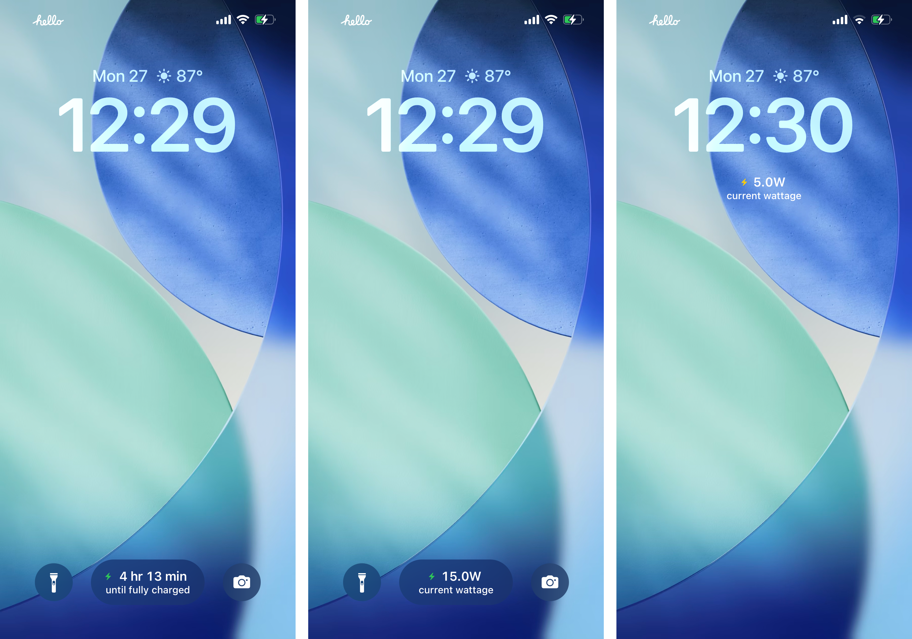
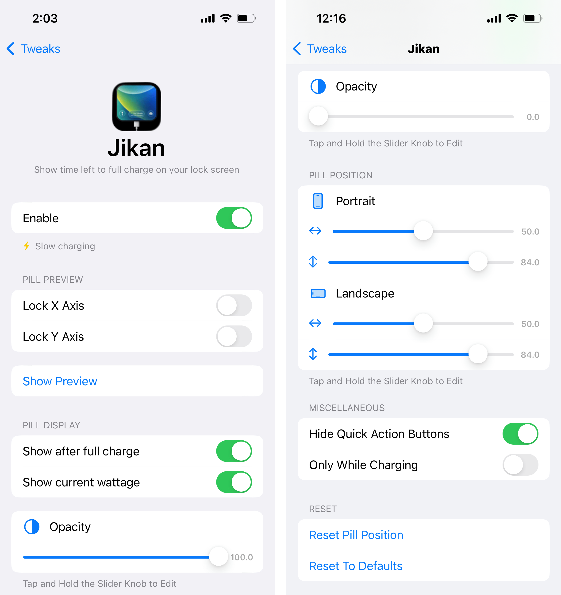

  

<h1 align="center">Jikan</h1>

  
  
  
  

## About

Jikan is an iOS jailbreak tweak that adds a charging pill to the lock screen. It blends with the lock screen quick action style and shows an estimated time until your device is fully charged.

## Screenshots

  

  

## How It Works

The estimation pipeline is implemented in `Tweak/TT100/TT100.m` (`estimatedTT100WithBatteryInfo:`) and backed by `Tweak/TT100/TT100Database.m`.

1. **Power source sampling**
   - `fetchBatteryInfo` reads `IOPMPowerSource` properties.
   - Capacity inputs are resolved in priority order:
     - `AppleRawMaxCapacity` / `AppleRawCurrentCapacity`
     - fallback: `DesignCapacity` + (`CurrentCapacity` / `MaxCapacity`)
   - SOC is normalized to `[0, 100]`, with early exit to `N/A` for invalid ranges.

2. **Live estimate path (instant fallback)**
   - Adapter power fields are resolved from `AdapterDetails` (`Wattage`, `Watts`, `Power`) or reconstructed from `Current * Voltage` with mA/mV normalization.
   - Current-based live ETA uses:
     - `liveEstimateSeconds = ((rawMax_mAh - rawCurr_mAh) / adapterCurrent_mA) * 3600`
   - If no historical model is usable, this path is used directly.

3. **Historical model (percent buckets)**
   - During charging sessions, Jikan records per-percent ticks and durations into SQLite tables (`sessions`, `ticks`, `percent_stats`).
   - Data is segmented by charger class (`wired_15w`, `wireless_10w`, etc.) to prevent cross-charger contamination.
   - Per-percent stats store robust central tendency and variance terms (`median_seconds`, `mean_seconds`, `m2_seconds`, `sample_count`, `last_updated_ts`).

4. **Confidence-weighted aggregation**
   - ETA is formed by summing bucket seconds from current SOC to 100%.
   - Current percent uses linear interpolation between floor/ceil buckets.
   - Each bucket gets a confidence weight:
     - sample term: `log1p(n) / log1p(20)`
     - uncertainty term: derived from spread (stddev/IQR fallback)
     - recency term: exponential decay with a ~14-day horizon
   - Missing future buckets mark the model as partial.

5. **Hybrid blend strategy**
   - If history is complete: use historical sum.
   - If history is partial and live path exists: blend
     - `eta = alpha * historical + (1 - alpha) * live`
     - `alpha` increases with model confidence (`~0.25 ... 0.90`).
   - Final ETA is formatted into `hr/min` strings for platter display.

The bolt icon indicates slow charging when the detected charge rate is below 5W. Otherwise, it uses the default green charging tint.

Preferences include controls for platter preview, opacity, portrait and landscape position, quick action visibility, and reset options.
