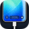
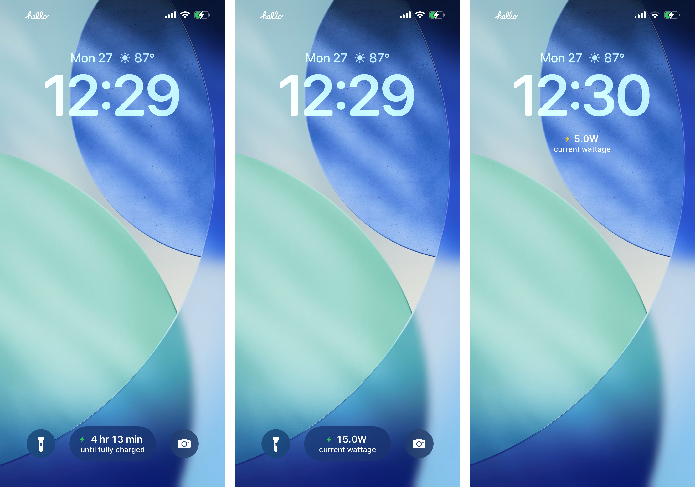
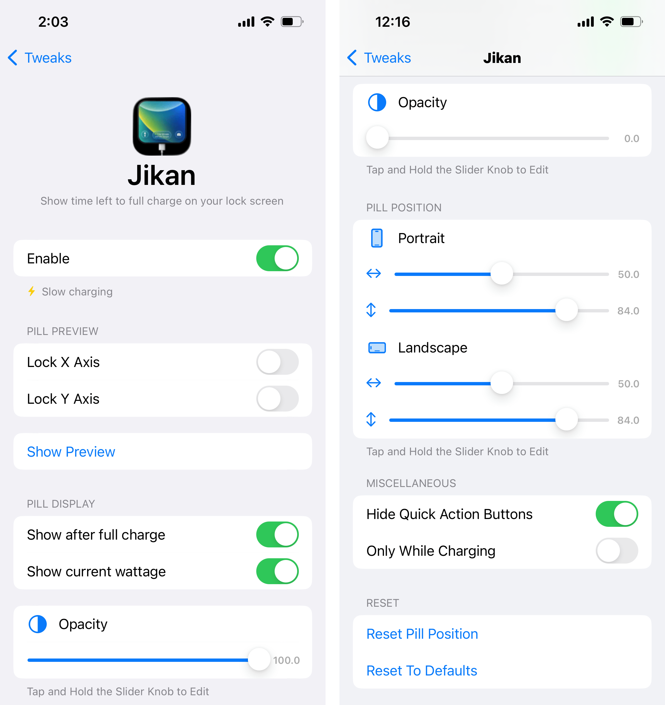

  

<h1 align="center">Jikan</h1>

  
  
  
  

## About

Jikan adds a charging pill to the lock screen, showing an estimated time to your selected charge target. Preferences includes live enable/disable, opacity, portrait and landscape position, quick-action visibility, preview editing, and optional ChargeLimiter target synchronization.
## Screenshots

  
  

