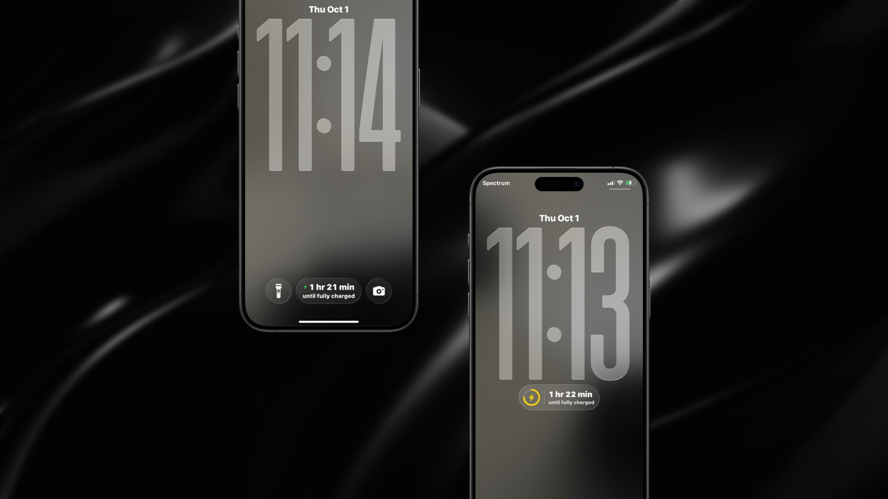
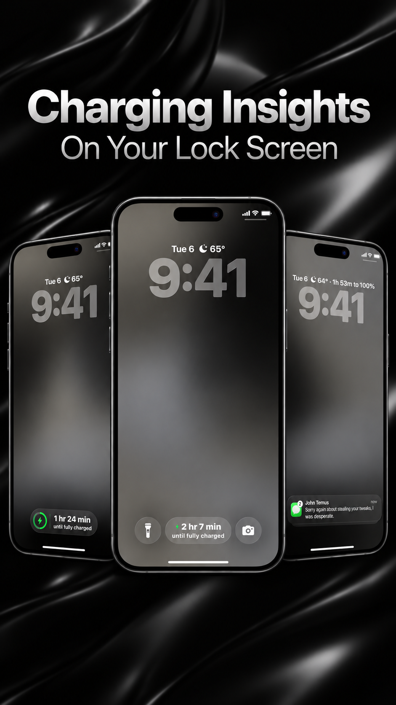
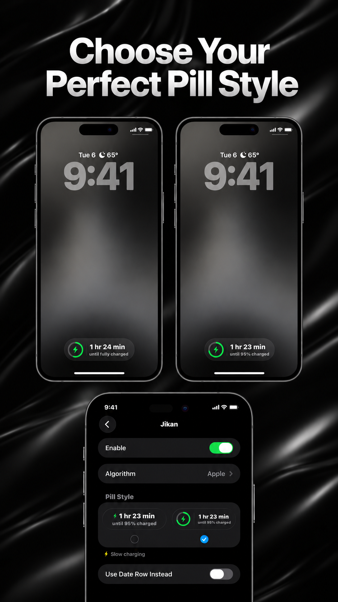
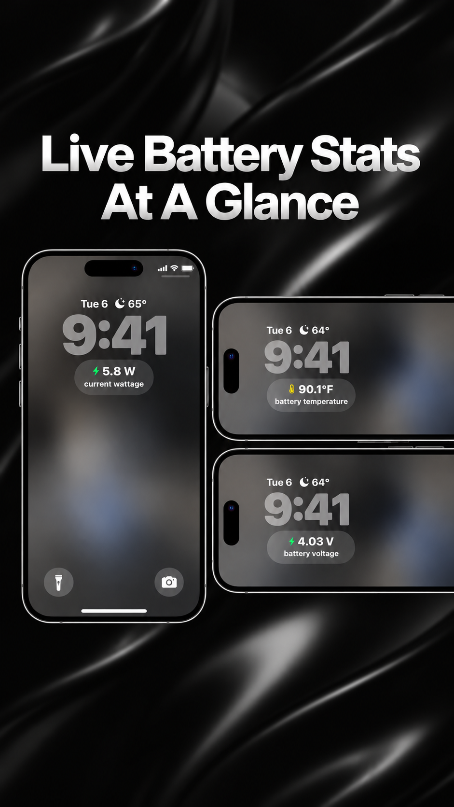
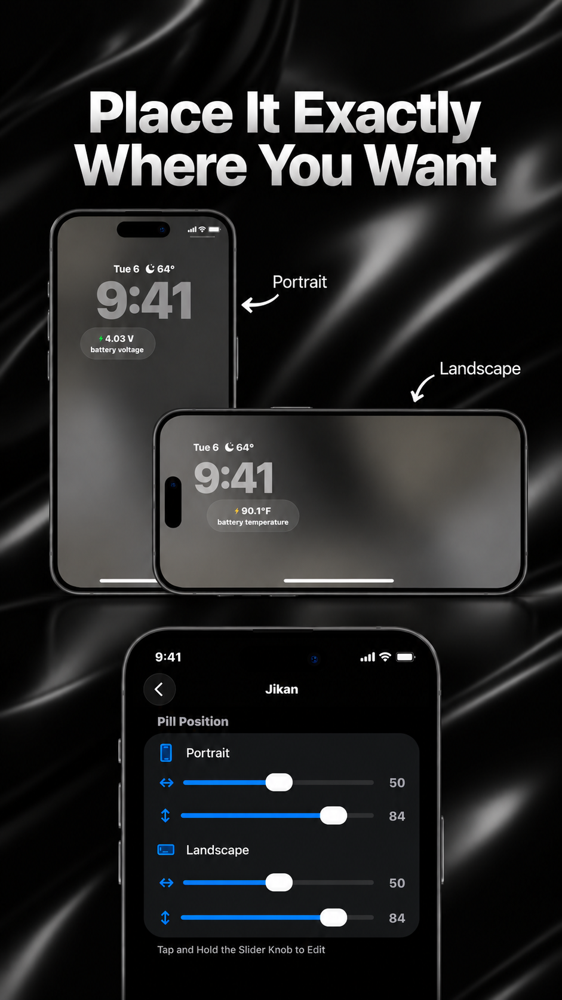

  

<h1 align="center">Jikan</h1>

  
  
  
  
  

## About

Jikan puts a charging estimate on your Lock Screen. Set the percentage you want to reach and see how much time is left. Choose a pill you can tap for more battery readings, or a compact estimate beside the date.

## Pill or date row

The Classic pill shows your remaining time with a charging indicator. Progress Ring shows the estimate alongside a circular display of your progress toward the selected target. You can preview both styles in Settings.

On iOS 16 or later, **Use Date Row Instead** places an estimate such as "27m to 80%" alongside the date. It also works with an existing inline widget.

## Charging estimates

Apple is the default and recommended algorithm. It uses reconstructed charging models based on Apple's iOS 26 estimator, with targets of 80%, 85%, 90%, 95%, and 100%.

The Jikan algorithm uses your device's charging history and current battery readings. It supports any whole percentage from 1% to 100%.

Both calculate estimates on your device. The target sets the percentage Jikan estimates toward; it doesn't change your phone's charging limit.

Read [how Jikan estimates charging time](docs/charging-estimates.md), including both algorithms and the reverse engineering behind Apple mode.

## Build your Stack

Estimated Time is always included. Add wattage, battery temperature, or battery voltage and arrange the optional readings in your preferred order. Tap the pill to cycle through them.

## Appearance and placement

- Turn Jikan on or off in Settings; the change takes effect immediately.
- Drag the pill in the Lock Screen preview or position it with sliders. Portrait and landscape positions are saved separately.
- Lock horizontal or vertical movement while adjusting its position.
- Adjust the background opacity, with Liquid Glass on supported systems.
- Preview the pill styles in Settings with your system's light or dark appearance.
- Use your system's temperature unit or choose Celsius or Fahrenheit.
- See a yellow charging indicator when charging is slow.
- Keep the charged state visible after reaching your selected percentage.
- Hide the Lock Screen quick action buttons always or only while charging.

## ChargeLimiter integration

If you use [ChargeLimiter](https://havoc.app/package/chargelimiter), set your charge limit there and tap **Sync with ChargeLimiter** in Jikan. It imports the limit as your estimate target, so you only have to enter the percentage once.

Tap Sync again whenever you change your limit. For limits outside Apple's presets, choose the Jikan algorithm.

## Localization and open source

Jikan includes English, German, Swedish, and Vietnamese. Contributions that add a language or improve a translation are welcome.

Jikan is open source under the [GNU GPLv3 license](LICENSE). You can explore the code, contribute improvements, or [report an issue](https://github.com/waruhachi/Jikan/issues).

## Support development

If you'd like to support me and Jikan's development, you can buy it on [Havoc](https://havoc.app/package/jikan). **The paid and free versions will always have the same features and functionality, with no paid-exclusive features.**

## Screenshots

  
  

  
  

