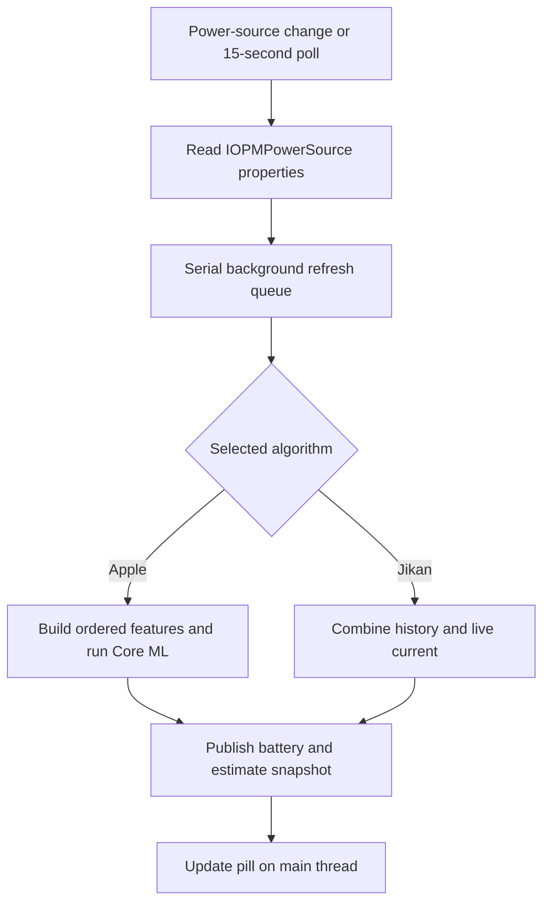

# How Jikan estimates charging time

Jikan has two charging-time algorithms: Apple, the default, and Jikan, its original estimator based on charging history and battery current. Both run locally and predict how long it will take to reach a selected percentage. Neither controls charging or changes the phone's charge limit. The ChargeLimiter integration copies a target into Jikan's preferences.

This guide covers the current implementation, the iOS 26.0 investigation on September 23 and 24, 2026, and the integration work that followed. The descriptions of Apple's internals apply to the inspected binaries and captured sessions; they do not establish how every iOS release or device behaves.

## The two algorithms

| | Apple algorithm in Jikan | Jikan algorithm |
| --- | --- | --- |
| Method | Local Core ML inference using reconstructed Apple model assets | Recorded time per percentage point, supplemented by live battery current |
| Targets | 80%, 85%, 90%, 95%, 100% | Any whole percentage from 1% to 100% |
| History | Fixed model weights; changing telemetry and session inputs | Charging history collected on this device |
| Main requirements | Compatible model files and the required battery telemetry | Usable history or enough capacity/current data to fill missing intervals |
| Updates | Manually replaced model assets and matching integration code | Statistics accumulate as Jikan observes charging |

In Apple mode, Jikan collects the inputs and runs the packaged models itself, without calling Apple's Battery Intelligence service. The models ran on the tested iOS 16.3.1 device as well as iOS 26.0. If an Apple prediction is unavailable, Jikan keeps the selected algorithm.

## From battery readings to the Lock Screen



[`TT100.m`](../Tweak/TT100/TT100.m) reads the battery service using `IOServiceMatching("IOPMPowerSource")` and `IORegistryEntryCreateCFProperties`. It listens for power-source notifications and polls every 15 seconds, with a one-second timer tolerance. Changes to the relevant UI or preferences also trigger refreshes. Expensive work runs on a serial queue. Generation checks discard results if Jikan was disabled or its preferences changed while the work was running.

The snapshot contains the estimate string, availability and status, selected algorithm, target, battery properties, and whether the target has been reached. [`Jikan.x`](../Tweak/Jikan.x) uses it to update the Lock Screen. Normally, the pill requires external power and a usable estimate. The optional after-charge display can show that the target has been reached. Show Preview displays sample text without creating a real estimate.

On iOS 16 or later, Use Date Row Instead puts the estimate in the date row when it fits. The localized text includes the selected target, such as 27m to 80% or 1h 23m to 100%, using the numeric remaining duration from either algorithm. Preview uses the same format and selected target. The pill keeps its two-line wording.

When an inline widget is present, Jikan measures the visible content in its native snapshot and centers it with the estimate, leaving a fixed gap. The widget's full native canvas and date formatting stay intact. The combined row can scale down to 80%. If Jikan cannot determine the content bounds or there is still too little space, it falls back to the pill. Changes to native content or appearance trigger an asynchronous measurement update.

Show Preview follows the selected display mode and uses the same pill fallback if the date row cannot display the estimate.

## How the Jikan algorithm works

### Learning charging durations

Jikan records charging sessions and percentage transitions in a local SQLite database, `Library/TT100/tt100.db` under the process user's home directory. Statistics are grouped by charger class, separating wired and wireless charging and different power tiers. A change in charger identity can end one recorded session and start another.

When the battery advances by several percentage points between observations, Jikan divides the elapsed time equally among those transitions. Explicit charging pauses reset the timing baseline, so the paused interval is not added to the next recorded charging step.

[`TT100Database.m`](../Tweak/TT100/TT100Database.m) stores sample counts, means, variance, and batch median and spread values. The estimator prefers a valid accumulated mean and falls back to the stored median for compatibility. It also retrieves uncertainty and age, but does not currently use them to weight or reject history buckets.

### Estimating the remaining interval

For every percentage interval between the current charge and the target, Jikan chooses a duration:

1. Use recorded statistics for the detected charger class.
2. If that class has no recorded statistics, try the `unknown` class.
3. If neither database lookup supplies history, try the legacy history reader.
4. Fill missing or unusable percentage intervals from live battery capacity and current.

The legacy reader looks for textual `INSERT INTO battery_history ...` records at a discovered `CurrentPowerlog.PLSQL` path. It is not a general Powerlog database decoder and may not find usable history on every device.

The live fallback calculates:

```text
seconds per percentage point =
    ((raw maximum capacity − raw current capacity) / (100 − current percentage))
    / battery current in mA × 3600

remaining seconds = sum(duration for each remaining percentage interval)
```

Capacity is in mAh. If raw capacity is unavailable, the code uses design capacity and the displayed charge percentage to approximate it. It prefers the magnitude of `InstantAmperage`, falling back to `Amperage` when necessary. The first partially completed percentage interval contributes only its remaining fraction.

Every remaining interval needs a usable duration. If neither history nor live current covers an interval, the estimate is unavailable.

This approach supports arbitrary targets and can learn the phone's charging pattern. An instantaneous charging rate cannot account for future tapering, thermal restrictions, or changes in phone usage. With sparse history, more of the estimate depends on that approximation.

## How Apple's iOS 26 implementation works

Apple documents charging-time estimates in Settings → Battery and on the Lock Screen in iOS 26. These predict time to 80%, or to full charge or the configured limit above 80%. [Apple's charge-speed guide](https://support.apple.com/en-ie/120619) describes the feature. The internal details below come from the device investigation.

### From Settings to the estimator

The inspected `BatteryUsageUI.bundle/BatteryUsageUI` binary uses `BIBatteryAnalysisClient` from `BatteryIntelligence.framework`. That client communicates with `/usr/libexec/batteryintelligenced` through its battery-analysis XPC service.

The observed targets were:

- **TT80**, target 0: time to 80%.
- **TTL**, target 1: time to the charge limit. The inspected TTL feature-validation path accepts 85%, 90%, 95%, and 100%.

A standalone client needed the `com.apple.batteryintelligenced.batteryanalysis-read` entitlement to obtain live results. Without it, the call failed. Responses included seconds, end percentage, charge percentage at prediction time, confidence, and other status information. A successful cached call could still return an unavailable or zero estimate, so the response had to be checked as well as the call's success.

### Model selection and session timing

The daemon selects a supported model version using Apple's Trial configuration, then loads its compiled bundle. The active versions observed on the test device were:

| Target | Original device asset | Input | Output |
| --- | --- | --- | --- |
| TT80 | `/usr/libexec/battery_analysis_tt80_model_bkwqiw7f79.mlmodelc` | Float32 `[1, 25]`, named `input_1` | `tt80_prediction` |
| TTL | `/usr/libexec/battery_analysis_ttl_model_k5wmzvi5mm.mlmodelc` | Float32 `[1, 29]`, named `input_1` | `ttl_prediction` |

File-open tracing confirmed that the active Trial-selected TTL version differed from the daemon's fallback version. Finding a model bundle on the device was not enough to identify the active model.

The inspected manager records plug-in time using `CLOCK_MONOTONIC_RAW` and obtains the starting charge percentage through `IOPSGetPercentRemaining`. It schedules a prediction job about four seconds after connection and another alarm 300 seconds after a charging prediction job finishes.

The network returns hours. The observed postprocessing is:

```text
TT80 seconds = model output × 3600
TTL seconds  = model output × 3600 + 300
```

The investigation confirmed the extra five minutes in TTL but did not establish why Apple adds it. The service stores each prediction with a monotonic timestamp and subtracts elapsed time when returning a later live result. Comparisons between readings need to account for that countdown.

## Reconstructing the model inputs

Running a `.mlmodelc` with the correct inputs required recovering the daemon's feature order, units, and session values.

[`JikanAppleFeatures.m`](../Shared/JikanAppleFeatures.m) implements the recovered mapping. The first ten values are common to both selected models, in this exact order:

| Index | Feature | Source/conversion |
| ---: | --- | --- |
| 0 | Estimated adapter watts | `AdapterDetails.Watts`; if absent, `AdapterVoltage × Current × 0.000001` |
| 1 | Temperature | Raw `Temperature` value, without converting it to degrees Celsius |
| 2 | Cycle count | `CycleCount` |
| 3 | Current charge percentage | `CurrentCapacity` |
| 4 | Nominal charge capacity | `NominalChargeCapacity` |
| 5 | Qmax | First element of `BatteryData.Qmax` |
| 6 | Depth of discharge | First element of `BatteryData.PresentDOD` |
| 7 | Design capacity | `DesignCapacity` |
| 8 | System input power | Native `PowerTelemetryData.SystemPowerIn × 0.001`, or validated measured input power when absent; converted to Float32 |
| 9 | Time since plug-in | Integer elapsed seconds from the session's monotonic clock |

TT80 then appends `is_wireless` at index 10. TTL first appends `InstantAmperage`, `Voltage`, starting charge percentage, and target percentage at indices 10 through 13, then `is_wireless` at index 14.

Both append 14 one-hot adapter-family values, in this order:

```text
0xe0004000, 0xe0004002, 0xe0004003, 0xe0004004, 0xe0004005,
0xe0004006, 0xe0004007, 0xe0004008, 0xe0004009, 0xe000400a,
0xe0024003, 0xe0024006, 0xe0024007, 0xe0024008
```

Each position is 1 when `AdapterDetails.FamilyCode` matches that 32-bit code, otherwise 0. The complete input has 25 values for TT80 or 29 for TTL. The model applies its own normalization constants, so the caller must not rescale the remaining inputs or normalize them again.

## How we reverse engineered and checked the pipeline

### 1. Find the actual data source

We compared the Battery page, registry readings, and the Battery Intelligence client. The registry's `TimeRemaining` stayed at 40 while the displayed Apple estimate changed. It was not a substitute for the native estimate.

Disassembly of BatteryUsageUI established the client path. IDA analysis of `batteryintelligenced` identified model selection, ordered feature names, registry lookups, session timing, and output conversion. Trial inspection and file-open tracing confirmed which bundles were active.

### 2. Capture real inference inputs

Temporary instrumentation captured the `input_1` tensors returned by `featureDictionaryForTarget:withInitialFeatures:withError:` during actual charging. We compared them with the daemon's persisted predictions and near-simultaneous read-only battery snapshots.

At 39% charge, the directly sourced fields and the Float32 system-power conversion matched the captured tensors. Elapsed time was 306 seconds for TT80 and 307 for TTL, so each prediction needed its own session time. In a later session with a different adapter, a nearby registry snapshot and the captured session parameters also reproduced all 25/29 feature values.

### 3. Decode and rebuild the networks

The selected bundles contained an Espresso network description and weights. Their architecture was:

```text
25 or 29 inputs
  → subtract learned means and multiply learned scales
  → dense 128 + ReLU
  → dense 64 + ReLU
  → dense 1 + Softplus
  → predicted hours
```

The decoded bundles used Float32 normalization constants and biases, with Float16 dense weight matrices in output-major order. An independent Python evaluator reproduced the recorded seconds within 0.00054 seconds across the original six saved cases.

We reconstructed source `.mlmodel` files with Core ML Tools 8.3 and compiled them for an iOS 14 deployment target. Core ML replay produced bit-for-bit identical Float32 outputs to the original bundles for all six cases: TT80 and TTL at 34%, 39%, and 64%. The reconstruction preserved Apple's parameters. It involved no new weight training and did not recover Apple's training dataset.

The models compiled for an iOS 14 target, but were not validated on an iOS 14 device.

### 4. Compare predictions at the same instant

The table shows examples from the captured runs, rounded to six decimal places. The native result is the stored prediction before the later countdown.

| Charge | Target | Replayed seconds | Apple-recorded seconds |
| ---: | --- | ---: | ---: |
| 39% | 80% | 2181.695080 | 2181.695080 |
| 39% | 100% | 7441.114140 | 7441.114140 |
| 64% | 80% | 974.815071 | 974.815071 |
| 64% | 100% | 5905.993652 | 5905.993652 |
| 41% | 80% | 3036.339569 | 3036.339569 |
| 41% | 100% | 7501.363850 | 7501.363850 |

For the 41% session, a native client read roughly 66 seconds later returned approximately 2970 and 7435 seconds. The countdown accounted for the difference; it did not indicate a reconstruction error.

### 5. Run on both test devices

The reconstructed models loaded and replayed all six original saved inputs on an iPhone12,1 running iOS 26.0 and an iPhone14,5 running iOS 16.3.1.

We checked live collection separately. On iOS 16.3.1 at 48% charge, about 177 seconds after plugging in at 44%, the models returned approximately 29 minutes to 80% and 1 hour 38 minutes to 100%. This verified live feature collection and inference on that device. The check did not compare the predictions with a native iOS 16 Battery Intelligence result or a completed charge cycle.

Later integration testing verified live estimates on the Lock Screen. With the iOS 16.3.1 cold-start fix, the pill also appeared after a respring while the phone was already plugged in, without opening Preview.

## How Jikan runs the Apple models today

[`TT100AppleEstimator.m`](../Tweak/TT100/TT100AppleEstimator.m) loads `tt80.mlmodelc` or `ttl.mlmodelc` from the packaged `Library/Tweak Support/Jikan/Models/iOS260` directory, resolved through the jailbreak's root-path helper. It checks the manifest revision, known model IDs, feature schema, network/weight SHA-256 hashes, and input/output descriptions before using a model. Core ML is configured for CPU-only execution.

Jikan uses the recovered feature order and conversion to seconds. It waits until at least four seconds after its recorded connection time, caches a prediction for up to 300 seconds, and subtracts elapsed time between predictions. Its 15-second refresh loop checks whether another inference is due. This schedule does not reproduce every event in Apple's daemon.

Disconnecting resets the model session. Changes to the target, adapter, or availability of native versus measured input power invalidate the cached prediction. An explicit charging pause clears it too.

If SpringBoard starts while the phone is already plugged in, Jikan uses the first valid sample's percentage and time as an approximate session start. This lets it resume predictions instead of remaining unavailable indefinitely. The result marks this recovery as `sessionStartEstimated`, since it can differ from Apple's original session baseline.

Jikan requires valid adapter and battery features and prefers native `PowerTelemetryData.SystemPowerIn`. When only that input is absent, [`TT100InputPowerProvider`](../Tweak/TT100/TT100InputPowerProvider.m) requests a fresh measurement from the packaged `JikanPowerd` helper. Invalid or zero native readings do not trigger substitution. The inspected daemon used device-specific constants for missing telemetry on a hardware target called `D79`. Jikan does not copy that special case.

Missing required inputs, invalid predictions, or model-loading failures make the estimate unavailable. Preview text does not override that status or switch to the Jikan algorithm.

### Measured input-power fallback

The helper runs as the mobile user, starts on demand through a local Mach service, and exits after ten idle seconds. Its entitlements permit AppleSMC client access and sensor reads without changing SpringBoard's entitlements. The IPC interface accepts no sensor keys and supports no writes.

The estimator requests a sample only when a new prediction is due and the other model features are valid. The request runs on its worker queue with a three-second IPC timeout.

The verified wired path uses `IQ0u` (input amperes), `VQ0u` (input volts), and `CHPS = 1`. It averages three samples spaced 250 ms apart after validating their `ioft` encoding and physical ranges. The helper checks the charging state and adapter before and after sampling. The caller checks them again and rejects samples older than three seconds.

Wireless charging, other unverified power paths, inaccessible sensors, and missing non-power features leave the estimate unavailable. The fallback does not substitute the charger's rating or net battery power.

Snapshots record `inputPowerSource` as `native`, `smc`, or `unavailable`. Measured readings stay separate from the battery registry dictionary. The preferences explain the fallback and recommend selecting Jikan if the required inputs cannot be obtained. A separate diagnostic defaults domain stores recent availability to support that explanation; it never changes the selected algorithm. See the [iPhone 8 investigation](iphone8-power-telemetry.md) for the measured comparison and the limits of device validation.

### Stack readings are separate measurements

The optional pill wattage uses battery current and voltage to calculate net power entering the battery. It does not show the adapter's rated watts. The Apple model's `curr_est_watts` input describes the adapter, while `curr_system_power` is a separate input. Using the pill's wattage for either feature would change the recovered model inputs.

The Stack keeps Estimated Time first. Users can add, remove, and reorder Wattage, Temperature, and Voltage. Temperature comes from the battery's top-level `Temperature` reading, converted from hundredths of a degree Celsius for display. Voltage comes from the top-level `Voltage` reading, converted from millivolts. Invalid or missing readings appear as N/A.

Temperature follows the iPhone's unit setting where available, with Celsius and Fahrenheit overrides. These display conversions leave the raw features passed to Apple's models unchanged.

## Estimate accuracy

Apple mode has performed better in the project's hands-on use. Its inputs include temperature, battery capacity and aging information, adapter type, system input power, and session progress. These can account for more charging conditions than a single current reading, which may explain the improvement. Accuracy has not been measured across all devices.

The reverse-engineering checks established that Jikan matches Apple's inference when given matching inputs. That does not mean a phone will reach its target at exactly the predicted time. Later workload, thermal pauses, optimized charging, and charger changes can affect when it gets there.

For useful comparisons:

- Start observing before plug-in when possible, so the starting percentage and elapsed time are known.
- Compare identical targets and timestamps; account for countdown between readings.
- Validate live input collection separately from saved-input model replay.
- Measure error against actual target arrival over completed sessions, across chargers, temperatures, battery conditions, and usage patterns.

The documented direct device checks cover iOS 26.0 and 16.3.1. They do not establish equivalent behavior on every supported OS or device, or equal accuracy at all TTL targets. The original native TTL comparisons used 100%. Support for 85%, 90%, and 95% came from the recovered accepted-target path and the implementation.

## Static models and manual updates

Jikan does not retrain these models or automatically follow Apple's Trial selections. The weights remain fixed until replaced. Changing battery inputs changes predictions without modifying those weights.

On the inspected iOS 26 device, Trial could select supported model versions already available to the daemon. The investigation found no local weight training and did not establish an active download path for new battery-analysis model bundles. Changes to the Trial selection, model bundle, or daemon could affect future attempts to reproduce Apple's estimates.

For a manual model update, verify the selected versions, graph, ordered features, output conversion, and device loading again. Preserve a record of the original and reconstructed files: recompilation can change file hashes even when the tested predictions are identical.

[`scripts/stage-private-models.sh`](../scripts/stage-private-models.sh) copies prepared `tt80.mlmodelc` and `ttl.mlmodelc` bundles into the package layout and writes their network/weight checksums:

```sh
sh scripts/stage-private-models.sh /path/to/prepared-model-directory
```

The script and loader currently identify the `iOS260` revision and model IDs above. Upgrading to a new model generation may also require changes to those identifiers, the feature mapping, and validation. Staging different files alone does not complete the upgrade.

## Implementation reference

| File | Responsibility |
| --- | --- |
| [JikanEstimateSettings.m](../Shared/JikanEstimateSettings.m) | Algorithm default, supported Apple targets, target validation |
| [TT100.m](../Tweak/TT100/TT100.m) | Battery reads, refresh queue, Jikan calculation, formatting, snapshots, wattage |
| [TT100Database.m](../Tweak/TT100/TT100Database.m) | Local charging history and per-percentage statistics |
| [JikanAppleFeatures.m](../Shared/JikanAppleFeatures.m) | Ordered Apple feature tensor and input validation |
| [TT100AppleEstimator.m](../Tweak/TT100/TT100AppleEstimator.m) | Model integrity/loading, session state, prediction and countdown |
| [Jikan.x](../Tweak/Jikan.x) | Recording transitions and applying estimate visibility to the Lock Screen |
| [Model manifest](../layout/Library/Tweak%20Support/Jikan/Models/iOS260/Manifest.plist) | Packaged model identities and checksums |

The historical measurements come from the original iOS 26 investigation notes and captured inputs. Current behavior was checked against the source files linked above. Earlier research notes cover work before integration; this guide describes the integrated implementation.
