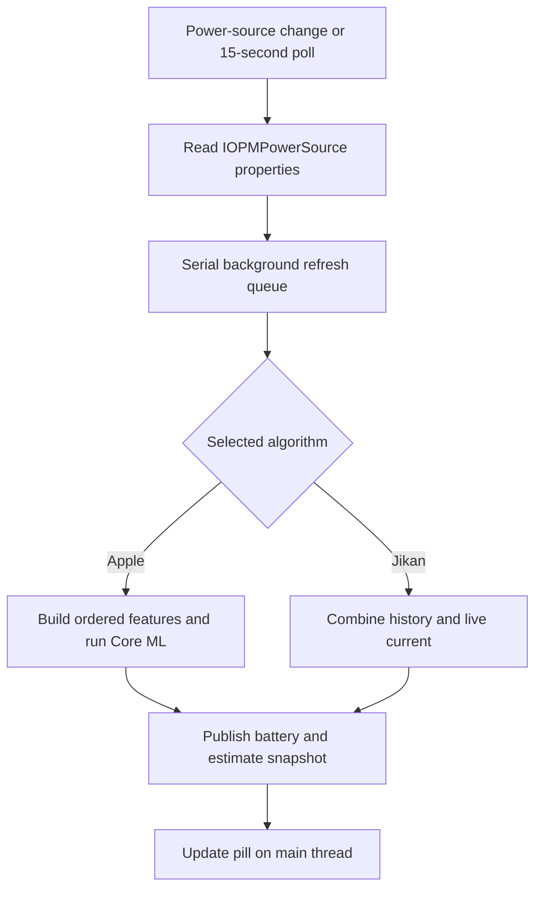

# How Jikan estimates charging time

Jikan offers two estimation algorithms: **Apple**, the default, and **Jikan**, its original history-and-current estimator. Both run locally. They predict time to a selected charge percentage; they do not control charging or change the phone's charge limit. ChargeLimiter integration copies a target into Jikan's preferences.

This guide describes the current implementation and the investigation of iOS 26.0 conducted on September 23–24, 2026, with subsequent Jikan integration work. Apple's internal behavior below refers to the inspected binaries and captured sessions, rather than every iOS release or device.

## The two algorithms

| | Apple algorithm in Jikan | Jikan algorithm |
| --- | --- | --- |
| Method | Local Core ML inference using reconstructed Apple model assets | Recorded time per percentage point, supplemented by live battery current |
| Targets | 80%, 85%, 90%, 95%, 100% | Any whole percentage from 1% to 100% |
| History | Fixed model weights; changing telemetry and session inputs | Charging history collected on this device |
| Main requirements | Compatible model files and the required battery telemetry | Usable history or enough capacity/current data to fill missing intervals |
| Updates | Manually replaced model assets and matching integration code | Statistics accumulate as Jikan observes charging |

Apple mode does not call Apple's Battery Intelligence service for its live estimates. Jikan collects the inputs and executes the packaged models itself. This makes model execution possible on the tested iOS 16.3.1 device as well as iOS 26.0. Jikan does not silently switch algorithms when an Apple prediction is unavailable.

## The shared battery-to-pill pipeline



[`TT100.m`](../Tweak/TT100/TT100.m) reads the battery service using `IOServiceMatching("IOPMPowerSource")` and `IORegistryEntryCreateCFProperties`. It listens for power-source notifications and polls every 15 seconds, with a one-second timer tolerance. Additional refreshes occur when the relevant UI or preferences change. Expensive work runs on a serial queue; generation checks discard results made obsolete by disabling Jikan or changing preferences.

The resulting snapshot includes the estimate string, availability/status, selected algorithm, target, battery properties, and whether the target has been reached. [`Jikan.x`](../Tweak/Jikan.x) uses that snapshot to update the Lock Screen. Normally, the pill requires external power and a usable estimate. The optional after-charge display can show a reached target. Show Preview can display sample text without creating a real estimate.

## How the Jikan algorithm works

### Learning charging durations

Jikan records charging sessions and percentage transitions in a local SQLite database, `Library/TT100/tt100.db` under the process user's home directory. It groups statistics by charger class, which distinguishes wired/wireless charging and power tiers. Charger identity changes can end a recorded session and begin another.

When the battery advances by several percentage points between observations, Jikan divides the elapsed time equally among those transitions. Explicit charging pauses reset the timing baseline, so the paused interval is not added to the next recorded charging step.

[`TT100Database.m`](../Tweak/TT100/TT100Database.m) maintains sample counts, means, variance information, and batch median/spread values. The estimator uses a valid accumulated mean first, with the stored median as a compatibility fallback. Although uncertainty and age are retrieved, the current prediction does not use them to weight or reject individual history buckets.

### Estimating the remaining interval

For every percentage interval between the current charge and the target, Jikan chooses a duration:

1. Use recorded statistics for the detected charger class.
2. If that class has no recorded statistics, try the `unknown` class.
3. If neither database lookup supplies history, try the legacy history reader.
4. Fill missing or unusable percentage intervals from live battery capacity and current.

The legacy reader looks for textual `INSERT INTO battery_history ...` records at a discovered `CurrentPowerlog.PLSQL` path. It is not a general decoder of Apple's Powerlog database and cannot be assumed to yield history on every device.

The live fallback calculates:

```text
seconds per percentage point =
    ((raw maximum capacity − raw current capacity) / (100 − current percentage))
    / battery current in mA × 3600

remaining seconds = sum(duration for each remaining percentage interval)
```

Capacity is in mAh. If raw capacity is unavailable, the code uses design capacity and the displayed charge percentage to approximate it. It prefers the magnitude of `InstantAmperage`, falling back to `Amperage` when necessary. The first partially completed percentage interval contributes only its remaining fraction.

Every remaining interval must have a usable duration. If neither history nor live current covers an interval, Jikan returns unavailable rather than presenting an incomplete sum.

This approach supports arbitrary targets and can learn the phone's charging pattern. Its main limitation is that an instantaneous charging rate does not describe future tapering, thermal restrictions, or changes in phone usage. Sparse history makes it rely more heavily on that approximation.

## How Apple's iOS 26 implementation works

Apple documents charge-time estimates in Settings → Battery and on the Lock Screen in iOS 26, with estimates to 80%, or to full charge/the configured limit above 80%. [Apple's charge-speed guide](https://support.apple.com/en-ie/120619) describes the visible feature; the internal details in this section come from the device investigation.

### From Settings to the estimator

The inspected `BatteryUsageUI.bundle/BatteryUsageUI` binary uses `BIBatteryAnalysisClient` from `BatteryIntelligence.framework`. That client communicates with `/usr/libexec/batteryintelligenced` through its battery-analysis XPC service.

The observed targets were:

- **TT80**, target 0: time to 80%.
- **TTL**, target 1: time to the charge limit. The inspected TTL feature-validation path accepts 85%, 90%, 95%, and 100%.

A standalone client needed the `com.apple.batteryintelligenced.batteryanalysis-read` entitlement to obtain live results. Without it, the call failed. Returned objects included seconds, end percentage, charge percentage at prediction time, confidence, and additional status information. A successful cached call could still return an unavailable/zero estimate, so a successful API call alone was insufficient validation.

### Model selection and session timing

The daemon selects a supported model version using Apple's Trial configuration, then loads its compiled bundle. The active versions observed on the test device were:

| Target | Original device asset | Input | Output |
| --- | --- | --- | --- |
| TT80 | `/usr/libexec/battery_analysis_tt80_model_bkwqiw7f79.mlmodelc` | Float32 `[1, 25]`, named `input_1` | `tt80_prediction` |
| TTL | `/usr/libexec/battery_analysis_ttl_model_k5wmzvi5mm.mlmodelc` | Float32 `[1, 29]`, named `input_1` | `ttl_prediction` |

Tracing actual file opens mattered: the daemon's fallback TTL version was different from the active Trial-selected version. The presence of a model bundle did not prove it was the one being used.

The inspected manager records plug-in time using `CLOCK_MONOTONIC_RAW` and obtains the starting charge percentage through `IOPSGetPercentRemaining`. It schedules a prediction job about four seconds after connection and another alarm 300 seconds after a charging prediction job finishes.

The network returns hours. The observed postprocessing is:

```text
TT80 seconds = model output × 3600
TTL seconds  = model output × 3600 + 300
```

The extra five minutes is an observed TTL transformation; the investigation did not establish Apple's rationale for it. The service stores a prediction with a monotonic timestamp and subtracts elapsed time when returning a later live result. Comparing values taken at different times without accounting for this countdown produces a misleading mismatch.

## Reconstructing the model inputs

The crucial work was recovering the same feature order, units, and session values used by the daemon. Merely finding and loading a `.mlmodelc` was not enough.

[`JikanAppleFeatures.m`](../Shared/JikanAppleFeatures.m) implements the recovered mapping. The first ten values are common to both selected models, in this exact order:

| Index | Feature | Source/conversion |
| ---: | --- | --- |
| 0 | Estimated adapter watts | `AdapterDetails.Watts`; if absent, `AdapterVoltage × Current × 0.000001` |
| 1 | Temperature | Raw `Temperature` value, without converting it to degrees Celsius |
| 2 | Cycle count | `CycleCount` |
| 3 | Current charge percentage | `CurrentCapacity` |
| 4 | Nominal charge capacity | `NominalChargeCapacity` |
| 5 | Qmax | First element of `BatteryData.Qmax` |
| 6 | Depth of discharge | First element of `BatteryData.PresentDOD` |
| 7 | Design capacity | `DesignCapacity` |
| 8 | System input power | `PowerTelemetryData.SystemPowerIn × 0.001`, converted to Float32 |
| 9 | Time since plug-in | Integer elapsed seconds from the session's monotonic clock |

TT80 then appends `is_wireless` at index 10. TTL first appends `InstantAmperage`, `Voltage`, starting charge percentage, and target percentage at indices 10–13, then `is_wireless` at index 14.

Both append 14 one-hot adapter-family values, in this order:

```text
0xe0004000, 0xe0004002, 0xe0004003, 0xe0004004, 0xe0004005,
0xe0004006, 0xe0004007, 0xe0004008, 0xe0004009, 0xe000400a,
0xe0024003, 0xe0024006, 0xe0024007, 0xe0024008
```

Each position is 1 when `AdapterDetails.FamilyCode` matches that 32-bit code, otherwise 0. This produces 25 TT80 values or 29 TTL values. The model contains its own normalization constants; the caller must not independently rescale the remaining inputs or normalize them a second time.

## How we reverse engineered and checked the pipeline

### 1. Find the actual data source

We compared the Battery page, registry readings, and the Battery Intelligence client. The registry's `TimeRemaining` stayed at 40 while the displayed Apple estimate changed. It was not a substitute for the native estimate.

Disassembly of BatteryUsageUI established the client path. IDA analysis of `batteryintelligenced` identified model selection, ordered feature names, registry lookups, session timing, and output conversion. Trial inspection and file-open tracing confirmed which bundles were active.

### 2. Capture real inference inputs

Temporary instrumentation captured the `input_1` tensors returned by `featureDictionaryForTarget:withInitialFeatures:withError:` during actual charging. We compared them with the daemon's persisted predictions and near-simultaneous read-only battery snapshots.

At 39% charge, the directly sourced fields and the Float32 system-power conversion matched the captured tensors. The elapsed values were 306 seconds for TT80 and 307 for TTL, illustrating why each prediction needs its corresponding session time. A later charging session with a different adapter also reproduced all 25/29 feature values from a nearby registry snapshot using captured session parameters.

### 3. Decode and rebuild the networks

The selected bundles contained an Espresso network description and weights. Their architecture was:

```text
25 or 29 inputs
  → subtract learned means and multiply learned scales
  → dense 128 + ReLU
  → dense 64 + ReLU
  → dense 1 + Softplus
  → predicted hours
```

The decoded bundles used Float32 normalization constants and biases, with Float16 dense weight matrices in output-major order. An independent Python evaluator reproduced the recorded seconds within 0.00054 seconds across the original six saved cases.

We then reconstructed source `.mlmodel` files with Core ML Tools 8.3 and compiled them for an iOS 14 deployment target. Core ML replay of those reconstructed models produced bit-for-bit identical Float32 outputs to the original bundles for all six cases: TT80 and TTL at 34%, 39%, and 64%. This preserved Apple's parameters; it did not train new weights or recover Apple's training dataset.

Compilation for an iOS 14 target was a build result, not an iOS 14 device-validation result.

### 4. Compare predictions at the same instant

Examples from the captured runs are below. Values are rounded to six decimal places; the native result is the stored prediction before later countdown.

| Charge | Target | Replayed seconds | Apple-recorded seconds |
| ---: | --- | ---: | ---: |
| 39% | 80% | 2181.695080 | 2181.695080 |
| 39% | 100% | 7441.114140 | 7441.114140 |
| 64% | 80% | 974.815071 | 974.815071 |
| 64% | 100% | 5905.993652 | 5905.993652 |
| 41% | 80% | 3036.339569 | 3036.339569 |
| 41% | 100% | 7501.363850 | 7501.363850 |

For the 41% session, a native client read roughly 66 seconds later returned approximately 2970 and 7435 seconds, consistent with the countdown. That difference was elapsed time, not a model-reconstruction error.

### 5. Run on both test devices

The reconstructed models loaded and replayed all six original saved inputs on an iPhone12,1 running iOS 26.0 and an iPhone14,5 running iOS 16.3.1.

Live collection was checked separately. On iOS 16.3.1 at 48% charge, about 177 seconds after a 44% plug-in, the models returned approximately **29 minutes to 80%** and **1 hour 38 minutes to 100%**. This established live feature collection and inference there; it was not a comparison against a native iOS 16 Battery Intelligence result or a completed charge cycle.

Subsequent Jikan integration testing verified actual Lock Screen estimates. The iOS 16.3.1 cold-start fix also produced a live pill after respring while already plugged in, without opening Preview.

## How Jikan runs the Apple models today

[`TT100AppleEstimator.m`](../Tweak/TT100/TT100AppleEstimator.m) loads `tt80.mlmodelc` or `ttl.mlmodelc` from the packaged `Library/Tweak Support/Jikan/Models/iOS260` directory, resolved through the jailbreak's root-path helper. It checks the manifest revision, known model IDs, feature schema, network/weight SHA-256 hashes, and input/output descriptions before using a model. Core ML is configured for CPU-only execution.

Jikan follows the recovered feature order and seconds conversion. It waits until at least four seconds after its recorded connection time, caches a prediction for up to 300 seconds, and subtracts elapsed time between predictions. The 15-second refresh loop checks whether another inference is due; this is not an exact reproduction of every daemon scheduling event.

Disconnecting resets the model session. A target change invalidates the cached prediction, and an explicit charging pause clears it. If SpringBoard starts while already plugged in, Jikan uses the first valid sample's percentage and time as an approximate start instead of staying unavailable indefinitely. That recovery is marked in the result as `sessionStartEstimated`; it can differ from Apple's original session baseline.

Jikan requires valid adapter, battery, and power-telemetry dictionaries. The inspected daemon had device-specific missing-telemetry constants for a hardware target called `D79`; Jikan does not copy that special case. Missing required inputs, invalid predictions, or model-loading failures produce an unavailable status. Preview text does not override that status or cause a fallback to the Jikan algorithm.

### Stack readings are separate measurements

The optional pill wattage reads net power entering the battery from battery current and voltage. It does not display the adapter's rated watts. Conversely, the Apple model's `curr_est_watts` input intentionally describes the adapter, while `curr_system_power` is another, separate input. Substituting the pill's wattage for either feature would change the recovered model inputs.

The pill's Stack keeps Estimated Time first and lets users add, remove, and reorder Wattage, Temperature, and Voltage. Temperature is the battery's top-level `Temperature` reading converted from hundredths of a degree Celsius for display; Voltage is the battery's top-level `Voltage` reading converted from millivolts. Invalid or missing readings appear as N/A. The temperature display follows the iPhone's temperature unit setting where available, with explicit Celsius and Fahrenheit overrides. These display conversions do not change the raw features passed to Apple's models.

## What “better estimates” means here

Apple mode has performed better in the project's hands-on use. Its inputs include temperature, battery capacity/aging information, adapter type, system input power, and session progress, allowing it to represent more charging conditions than a single current reading. That is a plausible explanation for the improvement, not a measured guarantee across all devices.

The strongest evidence from reverse engineering is **agreement with Apple's inference on matching inputs**. It does not establish zero error against the actual moment a phone reaches its target. Future workload, thermal pauses, optimized charging, and charger changes can alter the outcome after a prediction.

For useful comparisons:

- Start observing before plug-in when possible, so the starting percentage and elapsed time are known.
- Compare identical targets and timestamps; account for countdown between readings.
- Validate live input collection separately from saved-input model replay.
- Measure error against actual target arrival over completed sessions, across chargers, temperatures, battery conditions, and usage patterns.

The documented direct device evidence covers iOS 26.0 and 16.3.1. It does not prove equivalent behavior on every supported OS/device, nor equal accuracy at all TTL targets. The original native TTL comparisons were to 100%; 85%, 90%, and 95% support came from the recovered accepted-target path and the implementation.

## Static models and manual updates

Jikan does not retrain these models or automatically follow Apple's Trial selections. The weights remain fixed until replaced. Changing battery inputs changes predictions without modifying those weights.

On the inspected iOS 26 device, Trial could select supported model versions already available to the daemon. The investigation did not find local weight training or prove an active download path for new battery-analysis model bundles. A changed Trial selection, changed bundle, or changed daemon could each affect a future reproduction.

For a manual model update, verify the selected versions, graph, ordered features, output conversion, and device loading again. Preserve a record of the original and reconstructed files: recompilation can change file hashes even when the tested predictions are identical.

[`scripts/stage-private-models.sh`](../scripts/stage-private-models.sh) copies prepared `tt80.mlmodelc` and `ttl.mlmodelc` bundles into the package layout and writes their network/weight checksums:

```sh
sh scripts/stage-private-models.sh /path/to/prepared-model-directory
```

The script and loader currently identify the specific `iOS260` revision and model IDs above. Staging different files alone is not a complete upgrade to a new model generation; update those identifiers, feature mapping, and validation together when necessary.

## Implementation reference

| File | Responsibility |
| --- | --- |
| [JikanEstimateSettings.m](../Shared/JikanEstimateSettings.m) | Algorithm default, supported Apple targets, target validation |
| [TT100.m](../Tweak/TT100/TT100.m) | Battery reads, refresh queue, Jikan calculation, formatting, snapshots, wattage |
| [TT100Database.m](../Tweak/TT100/TT100Database.m) | Local charging history and per-percentage statistics |
| [JikanAppleFeatures.m](../Shared/JikanAppleFeatures.m) | Ordered Apple feature tensor and input validation |
| [TT100AppleEstimator.m](../Tweak/TT100/TT100AppleEstimator.m) | Model integrity/loading, session state, prediction and countdown |
| [Jikan.x](../Tweak/Jikan.x) | Recording transitions and applying estimate visibility to the Lock Screen |
| [Model manifest](../layout/Library/Tweak%20Support/Jikan/Models/iOS260/Manifest.plist) | Packaged model identities and checksums |

Historical measurements in this guide were consolidated from the original iOS 26 investigation notes and captured inputs. Current behavior was checked against the source files linked above. Earlier research notes describe intermediate states before integration; this guide describes the integrated implementation.
